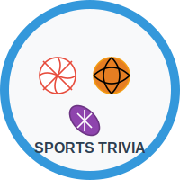

# The Ball Knowers - Sports Trivia Challenge



## Think you know ball? Settle the score.

The Ball Knowers is an interactive sports trivia app that tests your knowledge across multiple sports including MLB Baseball, NBA Basketball, and NFL Football. Challenge yourself with questions of varying difficulty and compete for high scores on the leaderboard.

## Live Demo

Play the game at: [https://cc-cruz.github.io/ball-knowers/](https://cc-cruz.github.io/ball-knowers/)

## Features

- **Multiple Sports Categories**: Test your knowledge in MLB Baseball, NBA Basketball, and NFL Football
- **Difficulty Levels**: Choose from Easy, Medium, or Hard questions
- **Personalized Experience**: Enter your name to track your scores on the leaderboard
- **Timed Challenges**: Answer questions within a time limit for added pressure
- **Hint System**: Use hints when you're stuck (but it will cost you points!)
- **High Score Tracking**: Local storage saves your best performances
- **Responsive Design**: Play on desktop or mobile devices
- **Keyboard Navigation**: Full keyboard support for accessibility
- **Sport-Specific Feedback**: Receive custom feedback based on your performance
- **Merged Question Categories**: All NBA and NFL questions, including pop culture and scandals, are now in their respective main categories

## Technologies Used

- React 18.2.0
- JavaScript (ES6+)
- CSS3 with animations
- Local Storage API
- GitHub Pages for deployment

## Installation and Setup

To run this project locally:

1. Clone the repository:
   ```
   git clone https://github.com/cc-cruz/ball-knowers.git
   ```

2. Navigate to the project directory:
   ```
   cd ball-knowers
   ```

3. Install dependencies:
   ```
   npm install
   ```

4. Start the development server:
   ```
   npm start
   ```

5. Open your browser and visit:
   ```
   http://localhost:3000/ball-knowers
   ```

## How to Play

1. **Enter Your Name**: Start by entering your name on the welcome screen
2. **Select a Sport**: Choose from MLB Baseball, NBA Basketball, or NFL Football
3. **Choose Difficulty**: Select Easy, Medium, or Hard mode
4. **Answer Questions**: You'll be presented with 10 questions to answer
5. **Beat the Clock**: Answer before the timer runs out (15 seconds per question)
6. **Use Hints**: Click the hint button if you need help (costs points)
7. **Check Your Score**: See your final score and how you rank on the leaderboard

## Deployment

This project uses a special deployment workflow:

1. All development work should be done in the `deploy-branch`:
   ```
   git checkout deploy-branch
   ```

2. To deploy to GitHub Pages, run:
   ```
   npm run deploy
   ```

3. This will build the app and push the built files to the `main` branch, which GitHub Pages serves.

4. The source code is maintained in the `deploy-branch`, while the `main` branch contains only the built files.

## Question Data

The app includes a variety of questions across different sports:

- **MLB Baseball**: Historical moments, player stats, World Series facts
- **NBA Basketball**: Player achievements, team records, basketball history and pop culture
- **NFL Football**: Super Bowl history, player records, team facts and scandals

## Future Enhancements

- Additional sports categories (NHL, Soccer, etc.)
- Online multiplayer mode
- Social media sharing
- Achievement badges
- Expanded question database

## Contributing

Contributions are welcome! Please feel free to submit a Pull Request.

## License

This project is licensed under the MIT License - see the LICENSE file for details.

## Acknowledgments

- All sports data and questions are for educational purposes
- Special thanks to all contributors and testers
